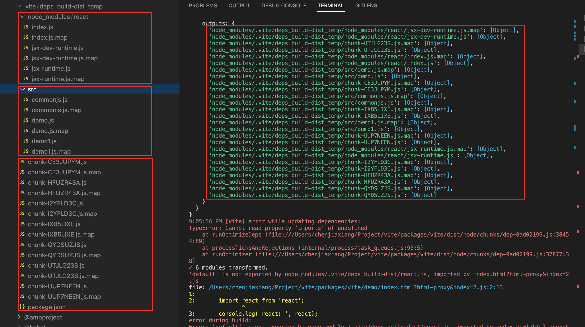

# 预优化 2.0

本篇章将讲述 Vite2.0 版本在预优化(Pre-Bundling)过程中所做的一些工作。

## 功能总览

Vite2.0 虽然底层代码跟 1.0 比改动很大，但总体理念和使用方式目前看起来差别不大。

Vite2.0 在底层代码的改动较大的地方大概是使用了 http + [connect](https://github.com/senchalabs/connect) 模块来代替 1.0 中的直接使用 koa 框架的一些能力。并且预优化的工具也由 rollup 的 [commonjs 插件](https://github.com/rollup/plugins/tree/master/packages/commonjs)替换为 [esbuild](https://esbuild.github.io/api/)。  
在 1.0 的使用过程中我就发现了一些 rollup 的 commonjs 插件的一些 [bug](https://github.com/rollup/plugins/issues/556)，并且提了一些 issue 记录，但是后续由于忙着开发自己的 [SSR 框架](https://github.com/ykfe/ssr)去了, 就没怎么跟进后续的进展。现在看到 2.0 换成了 esbuild，不仅构建速度大大提升，相应的 bug 也少了不少。  
在正式阅读源码前，本来以为 Vite 只是做了模块格式 `format:esm` 的简单操作，但是仔细阅读之后发现 Vite 做的工作还是不少的。这里大力推荐大家阅读一下 Vite2.0 的代码无论是仓库规范还是具体编码都是非常优秀值得大家学习的，且体量不大易于调试，比 Webpack 这些巨无霸级别的工具估计连作者自己都没办法掌握所有代码的要好得多。

## 本地调试

调试方式与 1.0 大体没有变化，只是 2.0 的架构变成了 monorepo 的形式，当然我们不需要管其他的 package，只需要调试 Vite 即可。

```bash
$ git clone git@github.com:vitejs/vite.git
$ cd vite && yarn
$ cd packages/vite && yarn build && yarn link
$ yarn dev
```

然后再通过 Vite 脚手架创建一个最简单的 example 来 link Vite

```bash
$ npm init @vitejs/app my-vue-app --template vue
$ cd my-vue-app && yarn && yarn link vite
$ npx vite optimize --force
```

然后就可以开始愉快的调试源码了

## vite esbuild 插件解析

这里我们舍去对本章内容不重要的 Vite resolve 模块的逻辑，只看 Vite 到底用 esbuild 干了什么  
我们直接找到最精华的一段代码

```ts
// vite/src/node/optimizer/index.ts

const esbuildService = await ensureService()
await esbuildService.build({
  entryPoints: Object.keys(flatIdDeps),
  bundle: true,
  format: 'esm',
  external: config.optimizeDeps?.exclude,
  logLevel: 'error',
  splitting: true,
  sourcemap: true,
  outdir: cacheDir,
  treeShaking: 'ignore-annotations',
  metafile: esbuildMetaPath,
  define,
  plugins: [esbuildDepPlugin(flatIdDeps, flatIdToExports, config)]
})
```

这里就是最终的 Vite 调用 esbuild api 的地方，让我们来一一分析它到底干了啥。  

### entryPoints

`esbuild` 处理依赖预构建的入口, `Vite` 在处理依赖预构建的时候会将 `bare id` 进行扁平化处理(若不进行扁平化, 那么 `react/jsx-runtime` 就会打包成 `node_modules` -> `react` -> `jsx-runtime`, 增加路径解析复杂度), 但是esbuild无法得知扁平化后的路径具体指的是哪个路径，因此写了 `vite:dep-pre-bundle` 插件来做模块路径映射处理。因此 `entryPoints` 会影响打包产物的格式。

```js
{
  'react_jsx-runtime': '/Users/Project/vite/packages/vite/demo/node_modules/react/jsx-runtime.js'
}
```

`Vite` 通过 `alias` 和 `vite:resolve` 插件来解析 `bare id` 并获取模块实际的绝对路径。

### bundle

bundle: true 就是将模块的依赖与模块自身打包成一个文件。这里对标的是 Webpack 的 bundle 功能而不是 tsc， babel 这种将原模块与 convert 之后的模块文件一一对应的这种工具。

### external

依赖外置，不需要处理的模块。这个选项在做服务端渲染或者应用体积优化的时候经常用到。举个例子当开启了这个选项并做了一些配置时。

```js
import * as React from 'react'
```

打包后的代码仍然保留这段代码，而不是将 react 的代码打包进来。 

### format

输出模块格式为 esm，这个没什么好说的

### outdir

预优化的缓存文件夹，默认为 `node_modules/.vite`

### plugins

`esbuildDepPlugin` 这个插件就是 Vite 在 esbuild 打包中最核心的逻辑了。让我们来看看他到底干了什么事情。  
在分析这个插件的源码之前，我们先看 esbuild 官方给的一个最简单的插件例子，来看看如何编写 esbuild 的插件，了解一个最基本的工作流程。

```js
let envPlugin = {
  name: 'env',
  setup(build) {
    build.onResolve({ filter: /^env$/ }, args => ({
      path: args.path,
      namespace: 'env-ns',
    }))
    build.onLoad({ filter: /.*/, namespace: 'env-ns' }, () => ({
      contents: JSON.stringify(process.env),
      loader: 'json',
    }))
  },
}

require('esbuild').build({
  entryPoints: ['app.js'],
  bundle: true,
  outfile: 'out.js',
  plugins: [envPlugin],
}).catch(() => process.exit(1))
```

这里我们编写了一个名字为 env 的插件。它干了什么事情呢，比如我们有下面的这一段源代码

```js
import { PATH } from 'env'
console.log(`PATH is ${PATH}`)
```
`esbuild` 在 `onResolve` 阶段通过正则匹配到了 `env` 这个我们想 `import` 的模块，并且把它交给了一个名称为 `env-ns` 的流程做最终的处理。在 `env-ns` 中，我们将当前的 `process.env` 环境变量 `stringify` 成 `json` 字符串的形式返回给了 `contents`。也就是 `env` 这个模块，最终返回的就是 `process.env` 的值

ok,了解完 esbuild 插件的一个基本的规范之后，我们再来看 `esbuildDepPlugin` 的内容。  
同样我们摒除暂时不需要关系的模块 resolve 逻辑，只看核心逻辑

### 特定文件 external

第一个处理是对特定格式文件的 external 处理，因为这些文件 esbuild 要么无法处理要么不应该由它来处理，Vite 自身会有另外的专门针对这些类型文件的处理逻辑。

```js

const externalTypes = [
  'css',
  // supported pre-processor types
  'less',
  'sass',
  'scss',
  'styl',
  'stylus',
  'postcss',
  // known SFC types
  'vue',
  'svelte',
  // JSX/TSX may be configured to be compiled differently from how esbuild
  // handles it by default, so exclude them as well
  'jsx',
  'tsx',
  ...KNOWN_ASSET_TYPES
]
export const KNOWN_ASSET_TYPES = [
  // images
  'png',
  'jpe?g',
  'gif',
  'svg',
  'ico',
  'webp',
  'avif',

  // media
  'mp4',
  'webm',
  'ogg',
  'mp3',
  'wav',
  'flac',
  'aac',

  // fonts
  'woff2?',
  'eot',
  'ttf',
  'otf',

  // other
  'wasm'
]
 build.onResolve(
  {
    filter: new RegExp(`\\.(` + externalTypes.join('|') + `)(\\?.*)?$`)
  },
  async ({ path: id, importer, kind }) => {
    const resolved = await resolve(id, importer, kind)
    if (resolved) {
      return {
        path: resolved,
        external: true
      }
    }
  }
)
```

### 区分入口模块和依赖模块

Vite 对入口模块和依赖模块使用了不同的处理规则，入口模块指的是我们直接 import 的模块或者通过 include 制定的模块。而依赖模块则是入口模块自身的依赖也就是 dependencies
这里可以看到如果是入口模块，我们则交给 `name` 为 `dep` 的流程去继续处理，且我们只返回一个 bare name，裸的模块名。比如 `vue`, `vue-router` 原始的名称。而非入口模块，我们则直接返回一个模块入口文件的绝对路径。

```js
function resolveEntry(id: string, isEntry: boolean) {
  const flatId = flattenId(id)
  if (flatId in qualified) {
    return isEntry
      ? {
          path: flatId,
          namespace: 'dep'
        }
      : {
          path: path.resolve(qualified[flatId])
        }
  }
}

build.onResolve(
  { filter: /^[\w@][^:]/ },
  async ({ path: id, importer, kind }) => {
    const isEntry = !importer
    // ensure esbuild uses our resolved entires
    let entry
    // if this is an entry, return entry namespace resolve result
    if ((entry = resolveEntry(id, isEntry))){
      return entry
    }
  }
)
```

### vite:dep-pre-bundle

这块的工作基本上是预优化的核心内容。这里 Vite 只干了一件事情，就是生成了一个虚拟模块来导出原模块的原始 id。
举个例子，上面我们提到了 Vite 会把入口模块交给 namespace 为 `dep` 的流程去做进一步的处理。且只传递给了一个最原始的 Bare id (代码中引入的模块, `import runtime from 'react/jsx-runtime'`, `react/jsx-runtime` 即为 Bare id )。
Vite 在处理预构建模块的时候会获取模块的 `exportData` (导入和导出信息), 通过 `es-module-lexer` 包来获取模块的导入和导出信息，不过需要注意的是, `es-module-lexer` 包在处理含 `jsx` 模块的时候会报错, 因此 Vite 在解析报错的时候(`catch` 到)会通过 `esbuild` 配置 jsx loader 来解析 `jsx` 模块, `transfrom` 完成之后再使用 `es-module-lexer` 包解析模块获取模块的导入和导出信息。
当入口模块即没有 `import` 关键字 也没有 `export` 关键字时，我们认为它是一个 `cjs` 模块。生成的代理模块的格式如下:

```js
contents += `export default require("${relativePath}");`
```

当入口模块使用 `export default` 进行导出时，我们生成的代理模块的格式如下

```js
contents += `import d from "${relativePath}";export default d;`
```

当入口模块存在 `ReExports` 时，比如 `export * from './xxx.js'` 或者 `export` 关键字出现的次数大于1，或者不存在 `export default`的时候生成的代理模块的格式如下
这也是大多数符合标准的模块最终处理完成的格式。

```js
contents += `\nexport * from "${relativePath}"`
```

以 Vue 为例，当我们处理完之后。执行 `import Vue from 'vue'` 时，`'vue'` 实际返回的 contents 是 `export * from "./node_modules/vue/dist/vue.runtime.esm-bundler.js"`

具体源码如下

```js
const root = path.resolve(config.root)
build.onLoad({ filter: /.*/, namespace: 'dep' }, ({ path: id }) => {
  const entryFile = qualified[id]
  let relativePath = normalizePath(path.relative(root, entryFile))
  if (!relativePath.startsWith('.')) {
    relativePath = `./${relativePath}`
  }

  let contents = ''
  const data = exportsData[id]
  const [imports, exports] = data
  if (!imports.length && !exports.length) {
    // cjs
    contents += `export default require("${relativePath}");`
  } else {
    if (exports.includes('default')) {
      contents += `import d from "${relativePath}";export default d;`
    }
    if (
      data.hasReExports ||
      exports.length > 1 ||
      exports[0] !== 'default'
    ) {
      contents += `\nexport * from "${relativePath}"`
    }
  }

  let ext = path.extname(entryFile).slice(1)
  if (ext === 'mjs') ext = 'js'

  return {
    loader: ext as Loader,
    contents,
    resolveDir: root
  }
})
```

#### 到这肯定会有很大一部分疑惑，为什么需要专门设计虚拟模块(dep)来进行处理呢?

通过以下注释

```js
// For entry files, we'll read it ourselves and construct a proxy module
// to retain the entry's raw id instead of file path so that esbuild
// outputs desired output file structure.
// It is necessary to do the re-exporting to separate the virtual proxy
// module from the actual module since the actual module may get
// referenced via relative imports - if we don't separate the proxy and
// the actual module, esbuild will create duplicated copies of the same
// module!
```

我们可以看出这样设计的目的有两个

- 使 `esbuild` 最终输出符合期望的结构
- 如果不分离虚拟模块和真实模块，`esbuild` 可能会重复打包相同模块

经过测试可以发现在 `esbuild` 新版本( `0.15.10` )中，产物输出的结构和 `entryPoints` 有关，因此通过插件直接重写路径(具体的模块路径)不会出现输出结构不符合期望的问题而也不会存在重复打包模块的问题。但是针对注释所处的 `esbuild` 版本( `0.8.34` )来说，测试的时候发现输出的结构和 `path` 有关系，因此不能直接通过插件重写路径，会存在非扁平化的效果，那么就想不改变 `path`，`path` 依旧为扁平化，通过 `load hook` 来读取模块的信息。结果通过 `fs` 读模块对于 `esbuild` 来说不可感知是否是同一模块，因此会导致打包重复产物的问题。那么 `fs` 这一条路就行不通了，后来就考虑可以通过重导出来的方式来进行 `load` 处理。这样就同时解决了产物非扁平化问题和重复打包模块的问题。


```bash
.vite
└── deps_build-dist_temp
    ├── chunk-CE3JUPYM.js
    ....
    ├── chunk-UUP7NEEN.js.map
    ├── node_modules
    │   └── react
    │       ├── index.js
    │       ├── index.js.map
    │       ├── jsx-dev-runtime.js
    │       ├── jsx-dev-runtime.js.map
    │       ├── jsx-runtime.js
    │       └── jsx-runtime.js.map
    ├── package.json
    └── src
        ├── commonjs.js
        ├── commonjs.js.map
        ├── demo.js
        ├── demo.js.map
        ├── demo1.js
        └── demo1.js.map
```

## esm 工具

上面分析完了 Vite2.0 的 optimize逻辑  
由于我们小组打算做一个基于 esm 的类似于 [codesandbox](https://codesandbox.io/) 的应用，在模块处理的过程中我们希望使用 Vite 的成熟能力，所以这里我把 Vite 的 optimize 功能简单的拆分了一下写了一个 [esm-optimize](https://www.npmjs.com/package/esm-optimize)模块。做到项目无关，同时不需要创建 vite.config 配置文件。根据入参找到具体的模块进行更新，方便上层业务根据实际情况决定要如何使用 optimize 能力。

### 使用方式

我们提供 cli 的形式或者模块的形式直接导入使用 

```bash
$ npm i -g esm-optimize
$ esm react vue # 优化 react vue 模块
$ esm react vue --force # 删除 cache 目录 强制重新 optimize
$ esm react vue --config # 显示最终生成的 config
```

以模块的形式使用

```js
import { optimize } from 'esm-optimize'

await optimize({
  root: string, // 默认为 cwd 
  optimizeCacheDir: string, // 默认的 vite 缓存文件夹为 `node_modules/.vite`
  optimizeDeps: {
    include: [] // 要处理的 模块
  },
  force: true // 强制优化
})
```

## SSR 框架

最后在这里推荐一下我写的 [SSR框架](https://github.com/ykfe/ssr) 在最新的 v5.0 版本中，同时支持 React 和 Vue 的服务端渲染框架，且提供一键以 Serverless 的形式发布上云的功能。我们可以非常有自信说它是地球上最先进的ssr框架。并且会在最近集成 Vue3 + Vite + SSR 的最佳实践。欢迎关注使用。