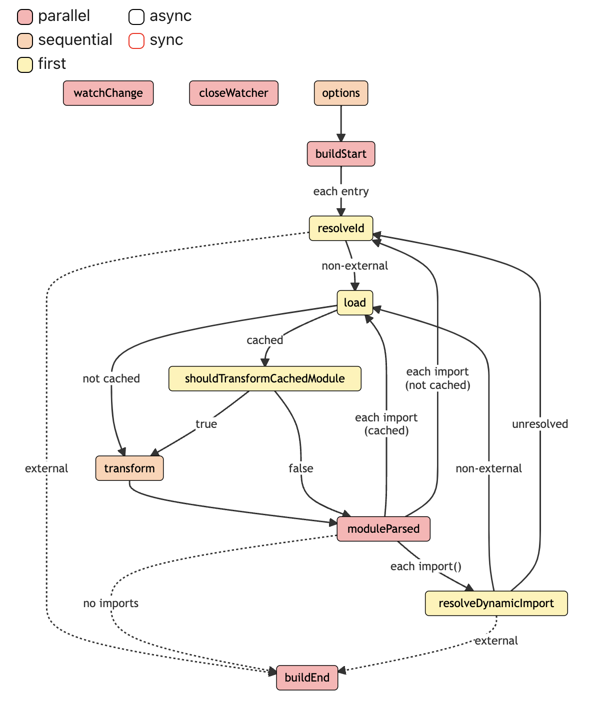

# 扩展

## Vite 插件机制和 Rollup 插件机制的区别

`Rollup` 插件的约定如下：

1. 插件应该有一个带有 `rollup-plugin-` 的前缀且名称清晰易懂。
2. 在 `package.json` 中包含 `rollup-plugin` 关键词。
3. 插件应该被测试。我们推荐使用 `mocha` 或者 `ava` 两款开箱即用的 promise 能力。
4. 尽可能使用异步方法。例如，使用 `fs.readFile` 替换掉 `fs.readFileSync`。
5. 插件文档使用英语来进行编写。
6. 如何可以的话确定插件输出正确的 `source mappings`。
7. 如果你的插件使用虚拟模块(例如用于辅助的函数)，模块ID以 `\0` 为前缀。这样做可以防止其他插件试图处理虚拟模块。

`Rollup` 插件由 `PluginDriver` 函数来进行驱动的。里面提供了如下 `hook`。

1. `hookFirst`

   **说明：**
   `链式 Promise` 执行对应插件的钩子且保持调用参数不变，`hookFirst` 返回首个调用 `插件` 结果为非 `null` 或 `undefined` 的值。

   **适用场景：**

   1. 链式调用返回第一个被插件处理的值。

   2. 支持异步插件。

   3. 不改变参数，各个插件独立。

   **相关的插件hook：**
   `load`、`resolveDynamicImport`、`resolveId`、`shouldTransformCachedModule`

    +  `resolveId`

    专门用来解析路径，对于相对路径转换为绝对路径通常只需要一个插件就可以实现。

   ```ts
   // rollup/src/utils/resolveIdViaPlugins.ts
   export function resolveIdViaPlugins(
        source: string,
        importer: string | undefined,
        pluginDriver: PluginDriver,
        moduleLoaderResolveId: (
            source: string,
            importer: string | undefined,
            customOptions: CustomPluginOptions | undefined,
            isEntry: boolean | undefined,
            skip: readonly { importer: string | undefined; plugin: Plugin; source: string }[] | null
        ) => Promise<ResolvedId | null>,
        skip: readonly { importer: string | undefined; plugin: Plugin; source: string }[] | null,
        customOptions: CustomPluginOptions | undefined,
        isEntry: boolean
    ): Promise<ResolveIdResult> {
        let skipped: Set<Plugin> | null = null;
        let replaceContext: ReplaceContext | null = null;
        if (skip) {
            skipped = new Set();
            for (const skippedCall of skip) {
                if (source === skippedCall.source && importer === skippedCall.importer) {
                    skipped.add(skippedCall.plugin);
                }
            }
            replaceContext = (pluginContext, plugin): PluginContext => ({
                ...pluginContext,
                resolve: (source, importer, { custom, isEntry, skipSelf } = BLANK) => {
                    return moduleLoaderResolveId(
                        source,
                        importer,
                        custom,
                        isEntry,
                        skipSelf ? [...skip, { importer, plugin, source }] : skip
                    );
                }
            });
        }
        return pluginDriver.hookFirst(
            'resolveId',
            [source, importer, { custom: customOptions, isEntry }],
            replaceContext,
            skipped
        );
    }
   ```
  
    + `load`
  
    `load` 与虚拟模块的加载有很强的关联，通常一个虚拟模块与插件之间是一对一的关系，因此只需要被一个插件所处理就可以了。

    ```ts
    // rollup/src/ModuleLoader.ts
    source = await this.readQueue.run(
      async () =>
        (await this.pluginDriver.hookFirst('load', [id])) ?? (await fs.readFile(id, 'utf8'))
    );
    ```

  2. `hookFirstSync`

  **说明：**

  同步执行对应插件的钩子且保持调用参数不变，`hookFirstSync` 返回首个调用 `插件` 结果为非 `null` 或 `undefined` 的值。

  **适用场景：**

  1. 链式调用返回第一个被插件处理的值。

  2. 不支持异步插件。

  3. 不改变参数，各个插件独立。

  **相关的插件hook：**
  `renderDynamicImport`、`resolveAssetUrl`、`resolveFileUrl`、`resolveImportMeta`

3. `hookParallel`

**说明：**
同参数，对于没返回值的直接执行而对于有返回值则收集后并行执行。不会等待当前插件执行完成，无返回值。

**适用场景：**

1. 需要任务尽可能的完成。

2. 不改变参数，不影响插件。

3. 支持同步和异步插件钩子。

**相关的插件hook：**
`buildEnd`、`buildStart`、`moduleParsed`、`renderError`、`renderStart`、`writeBundle`、`closeBundle`、`closeWatcher`、`watchChange`

4. `hookReduceArg0`

**说明：**
只改变第一个参数，链式 `异步调用` 插件对应的 hook，由 reduce 函数来决策对第一个参数的修改，前后插件有强制的先后依赖。

**适用场景：**

1. 有链式修改插件的第一个参数的需求。

2. 支持 `异步调用` 插件。

3. 链式调用。

**相关的插件hook：**
`options`、`generateBundle`、`renderChunk`、`transform`

5. `hookReduceArg0Sync`

**说明：**
只改变第一个参数，链式 `同步调用` 插件对应的 hook，由 reduce 函数来决策对第一个参数的修改，前后插件有强制的先后依赖。

**适用场景：**

1. 有链式修改插件的第一个参数的需求。

2. 仅支持 `同步调用` 插件。

3. 链式调用。

**相关的插件hook：**
`augmentChunkHash`、`outputOptions`

6. `hookReduceValue`

**说明：**
传入插件的参数不变，插件不感知 `initialValue` 发生的变化。通过插件的返回值和 `reduce` 函数来确定 `initialValue` 的值，`链式异步调用`。

**适用场景：**

1. 专门用来处理用户自定义的一个变量(`initialValue`)，也就是说若变量受到插件返回值影响的时候则就可以考虑使用。

2. 插件的参数不变，不影响插件的调用。

3. 存在异步插件。

**相关的插件hook：**
`banner`、`footer`、`intro`、`outro`

7. `hookReduceValueSync`

**说明：**
传入插件的参数不变，插件不感知 `initialValue` 发生的变化。通过插件的返回值和 `reduce` 函数来确定 `initialValue` 的值，`链式同步调用`。

**适用场景：**

1. 专门用来处理用户自定义的一个变量(`initialValue`)，也就是说若变量受到插件返回值影响的时候则就可以考虑使用。

2. 插件的参数不变，不影响插件的调用。

3. 不存在异步插件

**相关的插件hook：**
`augmentChunkHash`、`outputOptions`

8. `hookSeq`

**说明：**
传入插件的参数保持不变，链式调用各个插件。

**适用场景：**

1. 有强烈的插件顺序要求

2. 各个插件之间独立

3. 存在异步插件

**相关的插件hook：**
`options`、`generateBundle`、`renderChunk`、`transform`

**Rollup 插件执行图：**
需要注意的是 `Rollup` 在执行插件的时候会注入 `context`，为插件提供额外的能力。

```js
this.pluginContexts = new Map(
  this.plugins.map(plugin => [
    plugin,
    getPluginContext(plugin, pluginCache, graph, options, this.fileEmitter, existingPluginNames)
  ])
);
private runHook<H extends AsyncPluginHooks>(
  hookName: H,
  args: Parameters<PluginHooks[H]>,
  plugin: Plugin,
  permitValues: boolean,
  hookContext?: ReplaceContext | null
): EnsurePromise<ReturnType<PluginHooks[H]>> {
  const hook = plugin[hookName];
  if (!hook) return undefined as any;

  let context = this.pluginContexts.get(plugin)!;
  if (hookContext) {
    context = hookContext(context, plugin);
  }
  return Promise.resolve()
    .then(() => {
      // ...
    })
}
```

注入的 `context` 能力包含

1. **addWatchFile：(id: string) => void**

    添加要在 `watch` 模式下监听的其他文件，以至于但这些文件发生改变的时候会触发重构建流程。`id` 可以是绝对路径或者对于当前工作目录的相对路径。这个上下文方法只能用于构建阶段，如 `buildStart`、 `load`、 `resolveId`、 `transform`。

    **注意：**
    通常用于在 `watch` 模式下提升重打包的速度，只有当给定模块的内容实际发生更改时，才会触发 `transform` 的钩子。在 `transform` 中使用 `this.addWatchFile`，如果监听到文件发生了变化，那么 `transform` 钩子将会重新解析这个模块(是否需要rebuild)。

2. cache
3. emitAsset
4. emitChunk
5. **emitFile**

  生成新的需要被包含在构建输出的模块。方法会返回一个 `referenceId`，用户可以在各种地方使用 `referenceId` 来索引到新生成的模块。`emitFile` 支持两种格式：
  
  ```ts
    type EmittedChunk = {
      type: 'chunk';
      id: string;
      name?: string;
      fileName?: string;
      implicitlyLoadedAfterOneOf?: string[];
      importer?: string;
      preserveSignature?: 'strict' | 'allow-extension' | 'exports-only' | false;
    };

    type EmittedAsset = {
      type: 'asset';
      name?: string;
      fileName?: string;
      source?: string | Uint8Array;
    };
  ```

6. error
7. getAssetFileName
8. getChunkFileName
9. getFileName
10. getModuleIds
11. getModuleInfo
12. getWatchFiles
13. isExternal
14. load
15. meta
16. moduleIds
17. parse
18. resolve
19. resolveId
20. setAssetSource
21. warnv

`Rollup` 插件在构建阶段和输出生成阶段会调用各种钩子函数以此来触发 `plugin hook`。

执行流程图如下：


:::tip Rollup 插件机制总结
**优点：**
`Rollup` 的插件和其他大型框架大同小异，都是提供统一的接口并贯彻了约定优于配置的思想。`8` 种 `hook` 加载函数使 `Rollup` 的插件开发非常灵活，同时也带来了学习成本。

和 `Webpack` 相比，`Rollup` 的插件系统自成一派且没有区分 `plugin` 和 `loader`。`Rollup` 插件机制的核心是构建阶段和输出生成阶段的各种钩子函数。内部通过基于 `Promise` 实现异步 `hook` 的调度。

**缺点：**

1. 源码全都糅杂在一个库中，模块、工具函数管理的看起来很随意。

2. 无法直接移植它的任何工具到我们的项目中，相比起来，webpack 的插件系统封装成了一个插件 `tapable` 就很利于我们学习和使用。
:::

### Vite 在其中的作用

`Vite` 在构建阶段借助了 `Rollup` 的能力，因此需要兼容 `Rollup` 的插件生态(将 `dev` 阶段的插件兼容到 `build` 阶段)，通过借鉴 `Rollup` 的插件机制来实现一套类似的插件体系。

因此对于 `Vite` 来说也为插件实现了如下能力

1. 实现 `Rollup` 插件钩子的调度。
2. 实现类似 `Rollup` 的插件上下文机制。
3. 对钩子的返回值进行相应处理
4. 实现钩子的类型
  