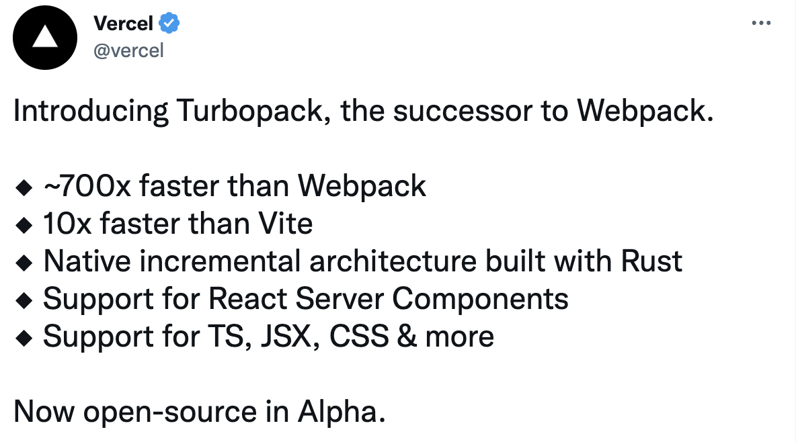
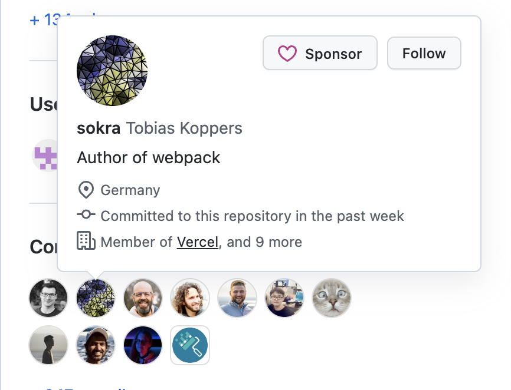

# 事件

## Vite 相关

### Is Turbopack really 10x Faster than Vite?

`Evan You` 在 `2022.11.1` 发布的一片[文章](https://github.com/yyx990803/vite-vs-next-turbo-hmr/discussions/8)。发布这篇文章的原因是 `Vercel` 在 `2022.10.26` 早上 `1.35` 的时候发布的推文，在该推文介绍了 `Webpack` 下一任基于 `rust` 实现的继承者 [Turbopack](https://turbo.build/)，
官方声明:

1. 比 `Webpack` 快近乎 `700` 倍。
2. 比 `Vite` 快 `10` 倍且甚至在更大的应用中差距将会达到 `20` 倍。
3. 用 `Rust` 构建的原生增量架构。
4. 支持 `RSC`。
5. 支持 `TS`、`JSX`、`CSS` 等基础能力。

在此来简单了解一下 `Turbopack`，这个令人兴奋的构建工具

从 `github` 上可以看到 `Turbopack` 是由 `Webpack` 的作者 `Tobias Koppers` 领导的基于 `rust` 实现的构建工具(目前处于 `alpha` 阶段)

官方提供的 [文章](https://vercel.com/blog/turbopack) 主要阐述了 `Turbopack` 在 `有多快`、`为什么这么快`、`未来的打算` 的表现。

+ 在 `有多快` 小结中介绍了 `Turbopack` 为了获得尽可能获取最快的开发体验而建立全新的增量架构(`rust` 默认开启[增量编译](https://rustwiki.org/zh-CN/edition-guide/rust-2018/the-compiler/incremental-compilation-for-faster-compiles.html)的能力)，从测试结果上看取得不错的进展。

+ 在 `为什么这么快` 小结中介绍了 `Turbopack` 架构结合了 `Turborepo` 和 `Bazel(Google)` 等工具的增量计算的创新，着重使用 **`缓存`** 来避免重复做同样的工作。
  `Turbopack` 的缓存能力如下:
    1. 细分到函数粒度的 `结果缓存`。可以 `缓存` 程序中的 `任意函数的结果`，只要确保函数的输入没有发生变化函数就不会被重复执行。这种细化的架构使程序在函数的执行层面上能够跳过大量的工作。
    2. 支持 `内存缓存`，未来还将有 `持久化缓存` 和 `远程缓存`。

  `Evan You` 也对 `Turbopack` 拥有强大的 **`缓存`** 能力做了赞许，宣称未来在合适的时机里会使用 `Turbopack` 来取代 `esbuild` 和 `rollup`。
  

+ 在 `未来的打算` 小结中介绍了 `Turbopack` 将被用于 `Next.js 13` 开发环境下提供快如闪电的 `HMR` 能力，并且支持原生 `RSC`、`TypeScript`、`JSX`、`CSS` 等能力。后续会逐步成为 `Next.js` 生产环节构建。同时也呼吁 `Webpack` 用户迁移到 `Turbopack` 以及共创 `Turbopack` 生态。

**`Turbopack` 引擎的工作原理**

在 Turbopack 驱动的程序中，可以将某些函数标记为“to be remembered”。当这些函数被调用时，Turbo 引擎会记住它们被调用的内容，以及它们返回的内容。然后它将其保存在内存缓存中。下面是一个简化的示例：

首先在 api.ts​ 和 sdk.ts​ 这两个文件中调用 readFile。然后打包这些文件，将它们拼接在一起，最后得到 fullBundle。所有这些函数调用的结果都保存在缓存中以备后用。

由于 sdk.ts​ 的结果发生了变化，就需要再次打包，然后需要再次拼接。重要的是，api.ts​ 并没有改变。只需从缓存中读取它的结果并将其传递给 concat。因此，这样就通过不读取并重新打包来节省了时间。

Turbo 引擎当前将其缓存存储在内存中。这意味着缓存将与运行它的进程一样长，这对于 Dev server 来说效果很好。将来，计划将这个缓存持久化——要么保存到文件系统中，要么保存到像 Turborepo 这样的远程缓存中。这意味着 Turbopack 可以记住跨运行和机器完成的工作。

这种方法使 Turbopack 在计算应用的增量更新方面非常快速，优化了 Turbopack 以处理开发中的更新，这意味着 Dev server 将始终快速响应更改。

回到开头，`Evan You` 发布了标题的 [文章](https://github.com/yyx990803/vite-vs-next-turbo-hmr/discussions/8)。里面的内容以 "探究 `Turbopack` 速度超出 `Vite` 十倍" 为论点在各基准上进行测试。
`Evan You` 肯定了 `Turbopack` 更快了，但是并不会比 `Vite` 快 `十倍`，`Vercel` 对外营销的数据是不正确的。
`Evan You` 使用了 `Next 13`(搭载了 `Turbopack`) 和 `Vite 3.2` 来对比两者处理 `HMR` 的性能。以下比较基准
> `root`：根节点组件。组件导入 `1000` 个不同的子组件并将它们一起渲染；
>
> `leaf`：叶节点组件。组件被根节点组件所导入，自身没有子组件。

  **1. 否开启 `RSC` ?**

  最初的基准测试是在服务端模式下使用根组件和叶子组件测量 `Next 13` 的 `HMR` 性能。 结果表明，`Next 13` 在两种情况下实际上都较慢，并且对于叶子组件而言差异更为明显，测试方法和测试结果如下。后来 `Evan You` 也注意到了开启 `RSC` 进行比较对于 `Next 13` 来说并不公平。因此就使用客户端模式来进行测试，发现 `Next 13` 的 `HMR` 的确提升显著，比 `Vite` 快了有 `2x`，但并不会达到如 `Vercel` 营销宣传的 `10x`。

  **2. `Vite` 对于 `React Transform` 是否是使用 `SWC(rust-based)` 而不是 `Babel(js-based)` 来进行解析?**
  
  `React HMR` 和 `JSX` 转换并不是与构建工具耦合，它可以通过 `Babel(js-based)`）或 `SWC(rust-based)` 来完成。`Esbuild` 也是可以转换 `JSX`，但缺乏对 `HMR` 的支持。`Vite` 对于处理 `React preset` 默认使用 `Babel` 来转换 `React HMR` 和 `JSX`。而 `SWC` 显然是比 `Babel` 快非常多(单个线程快了 `20x`, 多核快了 `70x`)。`Vite` 现阶段没有使用 `SWC` 的原因：

  1. 安装体积过大。会添加繁重的包体积(自身 `58M` 的大小而 `Vite` 也就 `19M`)
  2. 一些用户需要依赖 `Babel` 的能力做转换，因此对于部分用户来说 `Babel` 是不可缺失的。

  当 `Vite` 基于 `SWC` 来进行解析时，得出的结论为 `Next/turbo` 在根组件比叶子组件慢 `4` 倍，而 `Vite` 只慢 `2.4` 倍。这意味着 `Vite HMR` 在更大的组件中可伸缩性更好。此外，切换到 `SWC` 还可以改善 `Vite` 在 `Vercel` 基准测试中的冷启动指标。

#### `Vercel` 的澄清

在 `Evan You` 发布了基准测试之后，`Vercel` 发布了一篇博客文章，阐明了他们的基准方法，并将他们的基准提供给公众验证。`Evan You` 随即也吐槽了第一天就改这么做了。文章的关键点如下：

1. 在基准上测试 `Vite HMR` 性能的时候依旧是使用 `Babel`，而对于 `Turbopack` 和 `Webpack` 测试上使用了 `SWC`。这一点对于 `Vite` 来说是极为不公平的。
2. `1000` 个组件案例的原始数字存在舍入问题——`Turbopack` 的 `15ms` 被舍入到 `0.01s`，而 `Vite` 的 `87ms` 被舍入到 `0.09s`。 当原始数字接近 `6` 倍时，这进一步被宣传为 `10` 倍的优势；
3. `Vercel` 的基准测试使用更新模块的“浏览器评估时间”作为结束时间戳，而不是 `React` 组件重新渲染时间；
4. 博客文章中图表显示，当总模块数超过 `30k` 时，`Turbopack` 可以比 `Vite` 快 `10` 倍。

::: tip Vercel 的澄清总结
如果以下所有条件都成立，“比 Vite 快 10 倍”的说法是成立的：

1. Vite 没有使用相同的 SWC 转换。
2. 应用包含超过 30k 个模块。
3. 基准测试只测量热更新模块的评估时间，而不是实际应用更改的时间。
:::

**Even You 对 Vercel 澄清的看法：**

1. 对于绝大多数用户来说，`30k` 模块是极不可能的情况。使用 `SWC` 的 `Vite`，达到 `10` 倍要求所需的模块数量可能会变得更加不切实际。虽然理论上是可行的，但用它来营销 `Turbopack` 是不诚实的。
2. 与理论上的“模块评估”时间相比，用户更关心 `端到端 HMR` 性能，即从保存到看到更改的时间。当看到“更新速度快 10 倍”时，普通用户会想到前者而不是后者，`Vercel` 在其营销中忽略了这一警告。实际上，`Next` 中服务端组件（默认）的端到端 `HMR` 比 `Vite` 中的慢。

#### 对于 `Turbopack` 竞品的看法

##### `Evan You` 的观点

简单来说新竞品的出现对于 `Vite` 来说是否是互补关系还取决于设计者的目标，`Turbopack` 的出现对于市面上所有构建工具来说是一个十分强劲的对手，构建能力方面相对于其他构建工具来说是较为优秀的，可以在市面上获取很不错的收益和地位。从 `Evan You` 的说法上可以看出 `Turbopack` 可以作为 `meta frameworks` 的基本构建工具或者可以作为开箱即用的`spa` 解决方案。

##### `Anthony Fu` 的观点 - Vite 的核心团队成员

好的设计对性能的影响远比语言带来的提升更大，语言性能的加成更像一个常量系数，单纯更换语言只能带来有限的提升。`Vite` 更吸引人的是其插件系统，和构建在上面的生态系统。这样才能将改进快速带给其他领域。目前市面上暂时没有看到很好的基于原生语言的插件系统实现（同时兼顾性能和扩展性），在 `Turbopack` 实现插件系统前无法评价，暂时先静观其变。

> [如何评价Vercel开源的使用Rust实现的Turbopack? – Anthony Fu的回答 – 知乎](https://zhihu.com/question/562349205/answer/2733040669)

::: tip
  可以看出 `Anthony Fu` 评价一个构建工具主要从两方面考虑。第一个方面是性能要素，第二个方面是可扩展已有的生态。
:::

#### `Sean Larkin` 的观点 - Webpack 的核心团队创始人

1. 在我看来 `Turbopack` 更多是给予 `SWC` 的能力而非由于其自身创新的能力，希望对方能表达得清楚一些。
2. 我对 `Turborepo` 与 `Next` 的绑定程度感到失望。没办法， `Vercel` 需要挣到更多的天使资金。
3. 普遍用户很难从 `Webpack` 迁移到 `Turbopack`。
4. 我倾向于开发服务器上的模块仍然是打包后的，因为 `ESM` 比原始 `ESM` 慢。我需要剥离更多层，才能让独立的实现工作。
5. 目前 `Turbopack` 还处于 `alpha` 阶段，所以我们要看开一点，但我仍然希望多做一些实事而少一些营销。
6. 对于把 `Turbopack` 比作 `Webpack` 的继承者有失偏薄，如此营销显得虚伪且误导旁观者。作为继承者需要让 `Turbopack` 拥有 `Webpack` 所拥有的特性且能轻易的从 `Webpack` 迁移到 `Turbopack`。

::: tip
  对于把 `Turbopack` 比作 `Webpack` 的继承者是不合理的，这是两个不一样的工具，是共存关系而不是取代关系。这里面蕴含了大量的营销手段，借助 `Webpack` 创始人的身份来推销新构建工具，让一部分社区人士认为这是 `Webpack` 创始人 `wSokra` 创建的新构建工具并作为 `Webpack` 的下一代构建工具，在极短时间内获取社区的广泛关注。
:::

##### Lee Robinson 的回复 - Vercel 公司开发者体验副总裁

1. 没有 `SWC` 当然是不可能的，`Vercel` 研发团队前期在 `SWC` 上做了大量工作。
2. 现阶段先支持 `Next 13` 版本，后续目标是为所有框架提供支持。
3. `Webpack` 迁移到 `Turbopack` 还需要花费时间，并且我们确信我们会拥抱社区的(插件扩展能力)。

#### `wSokra` 的观点 - Webpack 和 Turbopack 的创始人

1. 目前把 `Turbopack` 比作 `Webpack` 的继承者是一种营销手段，且 `Webpack` 是肯定不会被弃用的。但 `Turbopack` 的更大愿景是提供 `95%` 的 `webpack` 的特性、思想(包括扩展能力)并且使其容易迁移。
2. `Turbopack` 渐进式的构建仅取决于改变文件的大小而不取决于总编译大小。对于 `Webpack` 来说，是按照总编译大小来做增量构建的，因为 `Webpack` 需要在缓存中检索所有的模块。后续还会初始构建流程中进一步提升 `Turbopack` 的构建速度。
3. 后续不再关心这个话题，因为无论如何每一个人都会去评估这个价值。作为两个项目( `Webpack` & `Turbopack` )的创始人，两个项目都是有价值的，而我在社区评估两者的价值会放大这件事情，对两个项目用户或支持者并不友好。

